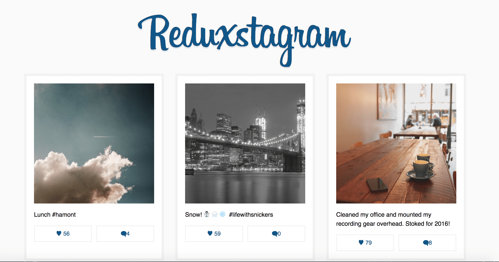
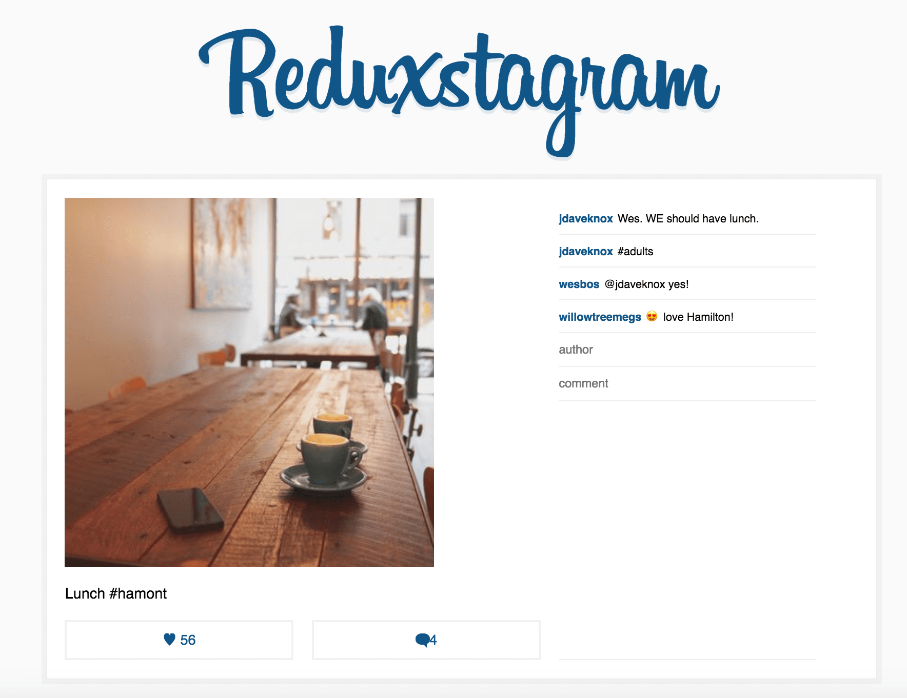

# Bang Nguyen - Redux

A simple React + Redux implementation.

Demo: https://bangnguyen-redux.netlify.com

## Features:
* React with redux, using react-router v3 together with react-router-redux

* Using Webpack v4 to bundle and task runner

* Hot Reloading Redux Reducers

* Support Redux dev tool

* Express server for development

* Dummy data for development

## Development

First `npm install` to grab all the necessary dependencies. 

Then run `npm start` and open <localhost:7770> in your browser.

## Production Build

Run `npm build` to create a dist folder and a bundle.js file.

### Main view of the app:

### Single view when click on the image

This app was based on [Learn Redux](https://learnredux.com/) of WesBos